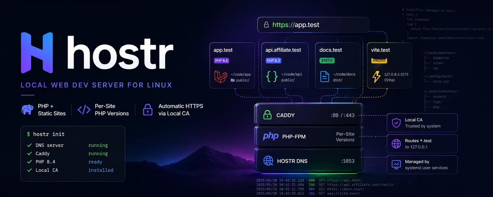

# hostr



hostr is a Linux local-development server for PHP, static, and proxied
dev-server projects under `.test` domains with local HTTPS.

It gives you a fast terminal workflow for local sites: park a directory, link a
project, pin PHP versions per site, proxy frontend dev servers, and inspect the
whole stack with one doctor command. hostr uses Caddy, systemd user services,
systemd-resolved, and static PHP builds instead of running its own long-lived
daemon.

## What hostr manages

- `.test` DNS through a local DNS responder
- HTTPS through Caddy's local CA
- PHP-FPM per installed PHP version
- Per-site PHP isolation for browser requests
- PHP and Composer CLI proxies that use the right project PHP
- Static sites and reverse proxies for frontend dev servers
- systemd user services for Caddy, DNS, and PHP-FPM

## Platform Support

hostr targets Linux desktops with systemd user services and systemd-resolved.
It serves local sites under `.test`, binds Caddy to localhost, and manages PHP
through static builds under `~/.local/share/hostr/php/`.

Intentionally out of scope: a GUI app, automatic in-place binary updates, macOS
support, non-systemd init systems, and arbitrary local TLDs. GitHub releases are
currently source/tag releases only; build locally with `git pull && bash
install.sh` until a binary artifact policy is chosen.

## Install

Install from a cloned checkout:

```bash
git clone https://github.com/scottzirkel/hostr.git
cd hostr
bash install.sh
```

The script builds hostr and symlinks `./hostr` into `~/.local/bin/`. Run it as
yourself, not with `sudo`. Re-running picks up the latest local build because
the symlink does not move. After the first run, `hostr <command>` works from any
directory.

If `~/.local/bin` is not on your `$PATH`, the script tells you and prints the
line to add to your shell rc.

## Quick start

```bash
hostr init                      # diagnose host resolver and required binaries
hostr install                   # provision services on alt ports (DNS :1053, :8080/:8443)
hostr php install 8.4           # fetch a static PHP build
hostr park ~/code               # any subdir of ~/code becomes <subdir>.test
hostr link                      # link the current dir as <basename>.test

# When ready:
hostr cutover                   # swap onto :80/:443 + route *.test through hostr
hostr cutover --rollback        # reverse it
```

## Daily commands

```
hostr tui                       # interactive dashboard (see Keys below)
hostr status                    # flat table — all sites + resolved settings
hostr open [name]               # xdg-open https://<name>.test (port-aware)
hostr logs <name>               # tail Caddy access + PHP errors for one site
hostr doctor [--probe] [--json] # health check; --probe also HEADs every site
hostr reload                    # re-detect docroots, regen fragments, reload Caddy
hostr restart [unit]            # restart all hostr services or one named unit

hostr php -v                    # run selected hostr PHP for this directory/site
hostr composer install          # run Composer using selected hostr PHP
hostr which-php                 # print selected hostr PHP binary
hostr php list / use / rm
hostr php ini set 8.4 memory_limit 512M
hostr php ini set 8.4 upload_max_filesize 128M
hostr php ini set 8.4 post_max_size 128M
hostr php ext list 8.4
hostr park / unpark / link / unlink / isolate / secure
hostr proxy <name> <port>       # reverse-proxy <name>.test → 127.0.0.1:<port>
hostr version                   # print version, commit, build date
```

## Health checks

`hostr doctor` checks user services, Caddy ports, hostr DNS, and the detected
cutover phase. Add `--probe` to send a HEAD request to every configured site.

For scripts and bug reports, `hostr doctor --json` emits a stable top-level
shape:

```json
{
  "services": [],
  "network": {},
  "dns": {},
  "cutover": {},
  "site_probes": []
}
```

`site_probes` is omitted unless `--probe` is used.

## PHP CLI proxies

hostr keeps browser PHP isolation and shell PHP selection separate.
`hostr isolate <site> <version>` controls PHP-FPM for browser
requests. For terminal commands, use hostr's proxies from inside a project:

```bash
hostr which-php
hostr php artisan test
hostr composer install
```

The proxy resolves the current directory to a hostr site, uses that site's
isolated PHP version when present, and otherwise falls back to `hostr php use`.
If multiple sites point at the same directory with different PHP versions, hostr
fails instead of guessing.

## PHP ini settings

Each installed PHP version can have local ini overrides. Settings are stored in
`~/.config/hostr/php/<version>/php.ini`, rendered into that version's PHP-FPM
pool, and applied by restarting only that PHP-FPM service.

hostr applies Laravel-friendly FPM defaults before user overrides: larger upload
limits, higher `max_input_vars`, realpath cache tuning, and OPcache sized for
framework apps while still validating timestamps for local development.

```bash
hostr php ini set 8.4 memory_limit 512M
hostr php ini set 8.4 upload_max_filesize 128M
hostr php ini set 8.4 post_max_size 128M
hostr php ini show 8.4
hostr php ini edit 8.4
hostr php ini unset 8.4 memory_limit
```

## PHP extensions

The bundled PHP builds use the upstream static-php-cli bulk profile. Extensions
are compiled into the PHP binary, so hostr lists what is available rather than
installing shared modules at runtime:

```bash
hostr php ext list 8.4
```

## Custom docroot

Auto-detection picks Laravel's `public/`, then `dist/`/`out/`/`build/`/`_site/`,
then the dir itself. Override when the heuristic gets it wrong:

```bash
cd ~/code/some-vite-app
hostr link --root dist          # serves dist/ instead of the autodetect's choice
```

## Shell completion

Cobra ships completion for bash/zsh/fish/powershell. Generate and source:

```bash
# zsh — drop into your fpath
mkdir -p ~/.zsh/completion
hostr completion zsh > ~/.zsh/completion/_hostr
# add to ~/.zshrc once: fpath+=~/.zsh/completion && autoload -U compinit && compinit

# bash
hostr completion bash > ~/.local/share/bash-completion/completions/hostr

# fish
hostr completion fish > ~/.config/fish/completions/hostr.fish
```

## Proxying dev servers

For Vite, Next, Astro, Rails, etc. — anything you'd normally hit at `localhost:<port>`:

```bash
npm run dev                     # Vite on :5173
hostr proxy myapp 5173          # myapp.test → 127.0.0.1:5173, with HTTPS + WebSockets
```

Targets accept `5173` (assumed `127.0.0.1:5173`), `:5173`, or `host:5173`. Caddy auto-handles
WebSocket upgrades, so HMR works.

## TUI

`hostr tui` opens a Bubble Tea dashboard with subdomain grouping, live HTTP probes, filters, and per-site actions.

| key | action |
|---|---|
| `j`/`k` or ↑/↓ | navigate |
| `g` / `G` | top / bottom |
| `pgup` / `pgdn` | page |
| `o` / Enter | open the highlighted site in the browser |
| `l` | tail logs for the highlighted site (Caddy access + PHP errors) |
| `r` | re-probe all sites |
| `/` | name search; type, Enter to lock, Esc to clear |
| `s` | cycle HTTPS filter: all → secure → insecure |
| `t` | cycle kind filter: all → php → static → proxy |
| `c` | cycle status filter: all → 2xx → 3xx → 4xx → 5xx → err → pending |
| `m` | toggle missing-docroot only |
| `x` | clear all filters |
| `q` / Ctrl-C | quit |

Layout reflows with the terminal — narrow widths drop KIND, LAT, DOCROOT in priority order. Wide terminals expand NAME and DOCROOT.

Subdomains (`api.affiliate`, `app.affiliate`, …) group under their parent (`affiliate.test`) with tree-style indentation. Missing docroots get a red `✗` prefix.

## Layout

| | |
|---|---|
| `~/.local/share/hostr/` | PHP builds, Caddyfile, site fragments, CA stash |
| `~/.local/state/hostr/` | sockets, logs, fpm runtime config |
| `~/.config/hostr/` | `state.json` (versioned parked dirs, links, default PHP), PHP ini overrides |
| `~/.config/systemd/user/hostr-*.service` | `hostr-dns`, `hostr-caddy`, `hostr-php@<spec>` |

## State file compatibility

`~/.config/hostr/state.json` is versioned. Current hostr writes `version: 1`.
Pre-version state files are treated as version 1 because they have the same
shape. If a future hostr writes a newer state version, older binaries fail
instead of guessing how to interpret it.

## Stack

- **DNS:** tiny Go responder for `*.test` on `127.0.0.1:1053` (`miekg/dns`). Zero upstream config — answers `127.0.0.1` for `*.test`, NXDOMAIN otherwise.
- **TLS:** Caddy issues from its built-in local CA. Root cert installed into the system trust store via p11-kit's `trust anchor` (so `curl` and Chromium-family browsers trust it).
- **PHP:** musl-static builds from [dl.static-php.dev](https://dl.static-php.dev/static-php-cli/bulk) — Laravel-ready extension set, no glibc dependency, plus hostr's Laravel-friendly FPM ini defaults. Per-version socket via templated systemd unit `hostr-php@<spec>.service`.
- **Routing:** Caddy's `php_fastcgi` for PHP sites (Caddy default `try_files` handles Laravel routing). `file_server` for static.
- **Process management:** systemd user units. hostr itself is a stateless CLI — no daemon.

## How it routes `*.test` after cutover

`browser → systemd-resolved (127.0.0.53) → per-link routing for ~test → 127.0.0.1:1053 (hostr-dns) → 127.0.0.1 → hostr-caddy → site fragment`

The per-link config goes in `/etc/systemd/network/<file>.d/hostr.conf` (one per existing `.network` file). Global routing via `/etc/systemd/resolved.conf.d/` doesn't pin queries to a specific server, so per-link is the only way to reliably route a single domain.

Cutover requires at least one `/etc/systemd/network/*.network` file. `hostr
cutover` refuses to run its sudo block if no `.network` files exist, before
changing resolver or port settings. If your machine uses NetworkManager without
systemd-networkd `.network` files, stay on Phase 1 or add a networkd-managed
link before running cutover.

## Troubleshooting

- **A site does not resolve:** run `hostr doctor`. In Phase 1, query hostr DNS
  directly with `hostr query app.test`; system-wide `.test` routing only happens
  after `hostr cutover`. `hostr doctor` shows the DNS answer, expected answer,
  and any raw query output when hostr-dns does not return an A record.
- **Caddy is not on the expected port:** run `hostr restart caddy` and then
  `hostr doctor`. If the cutover phase is partial, re-run `hostr cutover` or
  `hostr cutover --rollback` to converge. If HTTPS ports are bound while
  `hostr-caddy` is inactive, `hostr doctor` calls that out as a likely port
  ownership conflict.
- **Rollback resolver behavior:** `hostr cutover --rollback` removes hostr's
  per-link routing. The sudo rollback block restores `/etc/resolv.conf` to a
  detected legacy local-dev resolver when one exists; otherwise it restores
  systemd-resolved's stub resolver.
- **A PHP site returns 503:** install or select a PHP version with
  `hostr php install <ver>` and `hostr php use <ver>`, or isolate the site with
  `hostr isolate <site> <ver>`.
- **Certificates are not trusted:** re-run `hostr install` to reinstall the
  local CA. If it fails, the error names the Caddy root path and the failed
  `trust anchor` action. Confirm p11-kit is installed and restart browsers that
  cache trust state.
## Uninstall

```bash
hostr cutover --rollback        # if cutover was done
hostr uninstall --purge         # remove services, untrust CA, wipe hostr state/data/config
```

`--purge` deletes hostr-owned XDG directories named `hostr`
(`~/.local/share/hostr`, `~/.local/state/hostr`, and `~/.config/hostr`). It does
not delete your website/project directories referenced by parked dirs or links.
